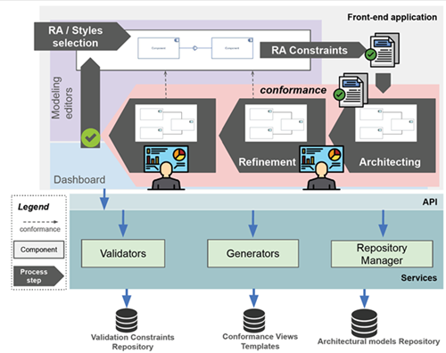
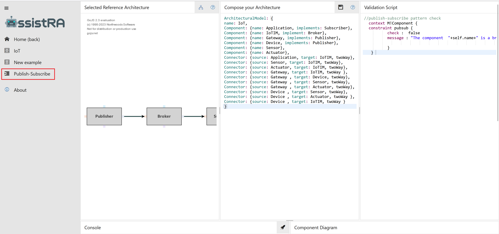
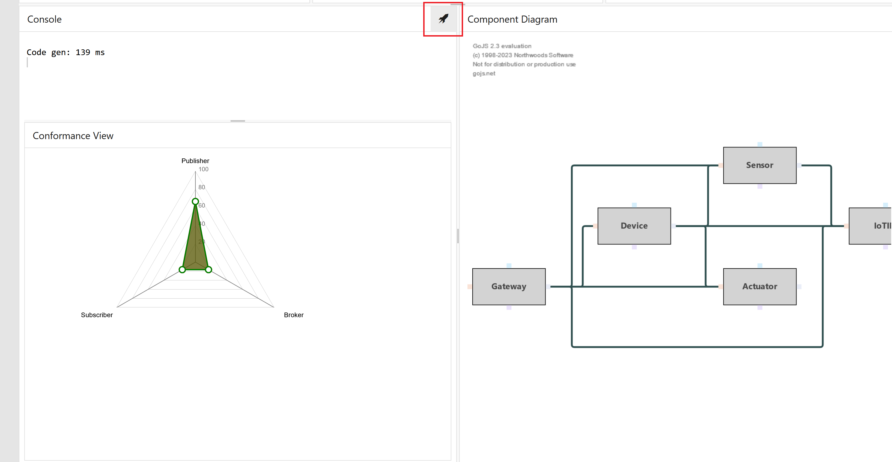

# ICSA 2024 Artifact Evaluation Track
## AssistRA: Continuous Conformance of Software Architectures
- Alessio Bucaioni (Mälardalen University, Västerås, Sweden)
- Amleto Di Salle (Gran Sasso Science Institute, L'Aquila, Italy)
- Ludovico Iovino (Gran Sasso Science Institute, L'Aquila, Italy)
- Leonardo Mariani (University of Milano-Bicocca, Milan, Italy)
- Patrizio Pelliccione (Gran Sasso Science Institute, L'Aquila, Italy)

## Abstract
Software architectures are pivotal in the success of software-intensive systems and serve as foundational elements that significantly impact the overall software quality. Reference architectures abstract software elements, define main responsibilities and interactions within a domain and guide the architectural design of new systems. Using reference architectures offers advantages like enhanced interoperability, cost reduction through reusability, decreased project risks, improved communication, and adherence to best practices. However, these benefits are most pronounced when software architectures align with reference architectures. Deviations from prescribed reference architectures can nullify these benefits. Uncontrolled misalignment can become prohibitively expensive, necessitating costly redevelopments, with maintenance costs reaching up to 90% of development costs. Conformance-checking processes and identifying and resolving violations in the software architecture are essential to mitigate misalignment. To address these challenges, we introduce the concept of continuous conformance that is expressed as a distance function and a process supporting it. Continuous conformance quantifies the degree to which a software architecture adheres to a designated reference architecture. We operationalize this process through an assistive modeling tool to support the continuous conformance process grounded in multi-level modeling techniques. The tool empowers software architects to specify various elements in a guided way, such as architectural styles, RAs, and SAs, using a unified notation with a flexible level of abstraction. 

The following public repository contains the [replication package](#systematic-literature-review-replication-package) about the used research process and tool evaluation. Moreover, it also contains the implemented assistive modeling tool named [AssistRA](#assistra-an-assistive-modeling-tool-supporting-continuous-conformance).

## Systematic Literature Review Replication package
The `slr-replication-package` folder contains the replication package related to the research process and the evaluation sections.
The folder structure is as follows:
- the `SLR` folder contains the all the artefacts for the systematic literature review
- the file `GR.xlsx` summarises the grey literature review process
- the `Pre-study` folder contains the transcript from the elicitation interviews
- the `Validation` folder contains the transcript from the validation interviews


## AssistRA: An assistive modeling tool supporting continuous conformance
The development of the assistive modeling tool designed to support the continuous conformance process is grounded in model-based techniques, with a focus on the concept of multi-level modeling. 
This tool empowers software architects to specify various elements, such as architectural styles, reference architectures (RAs), and software architectures (SAs), using a unified notation with a flexible level of abstraction. 
This means that each SA can express its conformance to a selected RA, and this process can be iterated across different levels of abstraction employed in architecting software systems. For example, this includes compliance of RAs with architectural styles or SAs with RAs. 
The notation used is inspired by the work in [1], which is based on a refinement of the component diagram offered by UML [2] and uses the components and connectors view to describe architectures. 

Consequently, each artifact in the proposed architecture is model-based or relies on model management operations, resulting in a highly customizable and flexible tool.

 

Figure shows an overview of the assistive modeling tool along with its workflow.

The tool is designed as a web-based application, with the back-end services responsible for checking, manipulating, storing, and retrieving models from the central repository. The front-end provides an interface for software architects for continuously architecting software systems while ensuring their conformance.

## Front-end
The `frontend` folder contains a web app communicating with the back-end services. The frontend app is simply an HTML page loading a selected RA and making calls to the backend services. The exchange of models is applied using a lightweight format called [Flexmi](https://eclipse.dev/epsilon/doc/flexmi/). The back-end services respond with JSON format of the required information. By selecting a RA from the left menu will preload a reference architecture from the server and will use it for the entire modeling process. The persistency of the architectural models modeled by the user is still unimplemented and currently, we offer some exemplary models pre-loaded from client-side. 

## Back-end services
The back-end consists of two main services

1. A generator for the reference architecture that can generate the graphical representation of the RA and also check whether a concrete architecture conforms to the selected RA

2. A generator translating the concrete architecture into a graphical version, checking also if the modeled architecture is compliant to the given constraints and finally generates the dashboard charts and information about the conformance.

These services will be called by the front-end via ajax calls.

To install the AssistRA tool, please follow [Installation Guide](/Install.md).

**Once front-end and back-end services are running and installed, open a browser and type [http://localhost/assistra](http://localhost/assistra)**

## Usage Example
This simple guide describes the AssistRA at work on realizing a scenario from a previous work [3, 4] to demonstrate how the continuous conformance process and supporting tool address the identified challenges. In this scenario, the authors introduce a RA for IoT systems and a set of concrete architectures conforming to the RA. One of the concrete architectures discussed is FIWARE, which we employ to test the process, tool, and workflow outlined earlier. 

The IoT RA is designed to be compliant with the Publish-Subscribe architectural style. In this style, communication is expressed between three types of components: the publisher, broker, and subscriber. 

To define the IoT RA, the following steps are needed:
- [Define the IoT reference architecture](#iot-reference-architecture-definition)
- [Define the FIWARE concrete architecture](#fiware-concrete-architecture-definition)

### IoT reference architecture definition
To create the IoT RA, in the AssistRA tool, select the publish-subscribe style from the repository, i.e., click on the "Publish-Subscribe" menu item, as shown in the Figure.

 

First, a corresponding component and connector view of the style is displayed, providing an immediate visualisation to the architect. 

The editor, named *Compose your Architecture*, is then available to initiate the definition of the RA, while the scripting editor, on the right, can be used to define further constraints that will be evaluated at run-time. 


To define the IoT RA, use the following code:
```
ArchitecturalModel: {
   name: IoT,
   type: RA,
   Component: {name: Application, implements: Subscriber},
   Component: {name: IoTIM, implement: Broker},
   Component: {name: Gateway, implements: Publisher},
   Component: {name: Device, implements: Publisher},
   Component: {name: Sensor, implements: Publisher},
   Component: {name: Actuator, implements: Publisher},
   Connector: {source: IoTIM, target: Application, twoWay},
   Connector: {source: Sensor, target: IoTIM, twoWay},
   Connector: {source: Gateway, target: IoTIM, twoWay},
   Connector: {source: Gateway , target: Device, twoWay},
   Connector: {source: Gateway , target: Sensor, twoWay},
   Connector: {source: Gateway , target: Actuator, twoWay},
   Connector: {source: Device , target: Sensor, twoWay},
   Connector: {source: Device , target: Actuator, twoWay},
   Connector: {source: Device , target: IoTIM, twoWay}
}
```

Moreover, delete the validation script example.

Then, click on the rocket icon and the IoT RA is completely defined and the component and connector view of the RA is also generated.

 

The console displays the time taken to generate the conformance view and the diagram. If the console does not report errors, and the conformance view shows the radar chart all in green, it indicates that conformance has been achieved. 

The defined architecture can then be submitted to the repository. This final step makes the defined architecture available for selection in the workspace in, enabling the IoT RA architecture to be used for defining SA.

### FIWARE concrete architecture definition


## License
AssistRA is Open Source software released under the [Apache 2.0 license](https://www.apache.org/licenses/LICENSE-2.0.html).

## References
1. Alessio Bucaioni, Amleto Di Salle, Ludovico Iovino, Ivano Malavolta, Patrizio Pelliccione. Reference architectures modelling and compliance checking, Softw. Syst. Model. Volume 22, pages 891-917, 2023, https://doi.org/10.1007/s10270-022-01022-z
2. John Cheesman, John Daniels. UML components: a simple process for specifying component-based software, 2000, Addison-Wesley Longman Publishing Co., Inc.
3. J. Guth, U. Breitenbücher, M. Falkenthal, P. Fremantle, O. Kopp, F. Leymann, and L. Reinfurt. A Detailed Analysis of IoT Platform Architectures: Concepts, Similarities, and Differences. Springer, 2018, pp. 81–101.
4. J. Guth, U. Breitenbücher, M. Falkenthal, F. Leymann, and L. Reinfurt. Comparison of iot platform architectures: A field study based on a reference architecture. in Cloudification of the Internet of Things. IEEE, 2016, pp. 1–6.